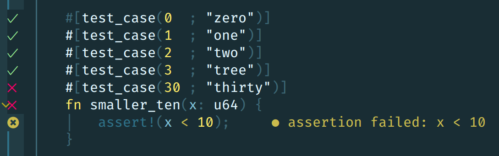
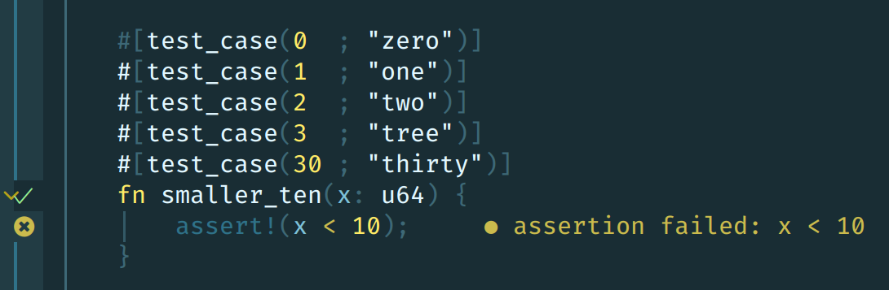
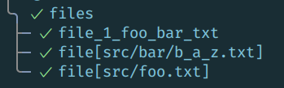

# neotest-rust

[Neotest](https://github.com/rcarriga/neotest) adapter for Rust, using
[cargo-nextest](https://nexte.st/).

Requires [nvim-treesitter](https://github.com/nvim-treesitter/nvim-treesitter)
and the parser for Rust.

```lua
require("neotest").setup({
  adapters = {
    require("neotest-rust")
  }
})
```

If you wish to give additional arguments to the `cargo nextest`,
you can specify the args when initializing the adapter.

```lua
require("neotest").setup({
  adapters = {
    require("neotest-rust") {
        args = { "--no-capture" },
        parameterized_test_discovery = "cargo"  -- One of { "none", "treesitter", "cargo" }
    }
  }
})
```

Supports standard library tests, [`rstest`](https://github.com/la10736/rstest),
Tokio's `[#tokio::test]`. Parameterized tests are also (partially) supported.

## Debugging Tests

Codelldb is the default adapter used for debugging.
Alternatives can be specified via the `dap_adapter` property during initialization.

```lua
require("neotest").setup({
  adapters = {
    require("neotest-rust") {
        args = { "--no-capture" },
        dap_adapter = "lldb",
    }
  }
})
```

See [nvim-dap](https://github.com/mfussenegger/nvim-dap/wiki/Debug-Adapter-installation),
and [rust-tools#debugging](https://github.com/simrat39/rust-tools.nvim/wiki/Debugging) if you are using rust-tools.nvim,
for more information.

## Parameterized Tests

Parameterized tests are difficult for external tooling to detect, because there exist many different macro
engines to generate the test cases. `neotest-rust` currently supports:

* [rstest](https://crates.io/crates/rstest)
* [test_case](https://crates.io/crates/test-case)

To discover parameterized tests `neotest-rust` offers two discovery strategies, which you can choose by setting the `parameterized_test_discovery` option during setup (or choose `none` to disable them entirely). Both have their unique characteristics:

| `parameterized_test_discovery` | `"treesitter"` | `"cargo"` |
|:---------|:------------|:------|
| general approach | Find special macros in the AST to determine which tests are parameterized | Call `cargo nextest list` and parse its output |
| use when | <ul><li>you want icons placed on each testcase directly</li><li>test case discovery to be faster</li><li>you don't want to wait to recompile your tests to discover changes</li></ul> | <ul><li>you are using `#[rstest::values(...)]`</li><li>you are using `#[rstest::files(...)]`</li><li>you are using `#[test_case(...)]` _without_ test comments</li><li>the `treesitter` mode doesn't detect your test(s)</li></ul> |
| `#[rstest]` | ✓ | ✓ |
| `#[rstest]` with `async` | ✓ | ✓ |
| `#[rstest]` with [injected fixtures](https://docs.rs/rstest/latest/rstest/attr.rstest.html#injecting-fixtures) | ✓ | ✓ |
| `#[rstest]` with [rename fixtures](https://docs.rs/rstest/latest/rstest/attr.rstest.html#injecting-fixtures) | ✓ | ✓ |
| `#[rstest]` with [partial injection](https://docs.rs/rstest/latest/rstest/attr.fixture.html#partial-injection) | ✓ | ✓ |
| `#[rstest]` with [async fixtures](https://docs.rs/rstest/latest/rstest/attr.rstest.html#async) | ✓ | ✓ |
| `#[rstest]` with [timeouts](https://docs.rs/rstest/latest/rstest/attr.rstest.html#test-timeout) | ✓ | ✓ |
| `#[test_case(...)]` | ✓ | ✓ |
| `#[test_case(...)]` with `async` | ✓ | ✓ |
| `#[rstest]` with [parameters](https://docs.rs/rstest/latest/rstest/attr.rstest.html#use-specific-case-attributes) | ✓ | ✓ |
| `#[rstest]` with [parameter descriptions](https://docs.rs/rstest/latest/rstest/attr.rstest.html#optional-case-description) | ✓ | ✓ |
| `#[rstest]` with [values](https://docs.rs/rstest/latest/rstest/attr.rstest.html#values-lists) | ✗ | ✓ |
| `#[rstest` with [files](https://docs.rs/rstest/latest/rstest/attr.rstest.html#files-path-as-input-arguments) | ✗ | ✓ |
| [`rstest_reuse`](https://docs.rs/rstest/latest/rstest/attr.rstest.html#use-parametrize-definition-in-more-tests) | ✗ | ✗ |
| `rstest` case names | enumerated, e.g. `case_1` | enumerated, e.g `case_1` |
| `#[test_case]` case names | Proper, but requires a [case name comment](https://github.com/frondeus/test-case/wiki/Test-Names) (e.g. `#[test_case(... ; "name comment")]`) | Same as `cargo nextest list` outputs it |
| discovery done | instantly (synchronous) when tree-sitter has parsed the document| delayed (asynchronously) when cargo has compiled the project |
| case location (e.g. when you jump to test from summary panel and where result check marks are displayed) | Each case points to its corresponding macro above the test function  | All cases of a test point to test itself  |


## Limitations

The following limitations apply to both running and debugging tests.

- Assumes unit tests in `main.rs`, `mod.rs`, and `lib.rs` are in a `tests`
  module.
- When running tests for a `main.rs` in an integration test subdirectory (e.g.
  `tests/testsuite/main.rs`), all tests in that subdirectory will be run (e.g.
  all tests in `tests/testsuite/`). This is because Cargo lacks the capability
  to specify a test file.
- When using `#[test_case(...)]` for parameterized tests and `treesitter` as
  discovery mode, make sure to _always_ use a test comment (e.g.
  `#[test_case(arg1, arg2, ... ; "test_comment")]`). Otherwise the test runner
  might not find this case. With `cargo` as strategy this is not strictly
  necessary.
- When using for example `#[rstest::files("**/*.txt")]` in a test the discovery
  tries to heuristically "guess" each file and render it in the summary view.
  This only works, though, if the file exists relative to the project root
  and contains no special characters except underscores (and `.` before the file
  extension). Otherwise the name resolution is just skipped and the `cargo`
  id is displayed. Has no influence on the running of each test case, only for
  the name in the summary. 
- When using a combination of `rstest` features the _first_ one in the argument
  list always decides on the heuristic name resolution. For example if you have
  a test like `fn foo(#[case] x: i32, #[files("*")] file: PathBuf) {}` the name
  resolution will try to resolve the test ID based on the `case` attribute, which
  is not consistent with the `files` rendering. Try swapping arguments if necessary.
  Has no influence on the running of each test case, only for the name in the summary

Additionally, when debugging tests, no output from failed tests will be captured in the results provided to Neotest.
